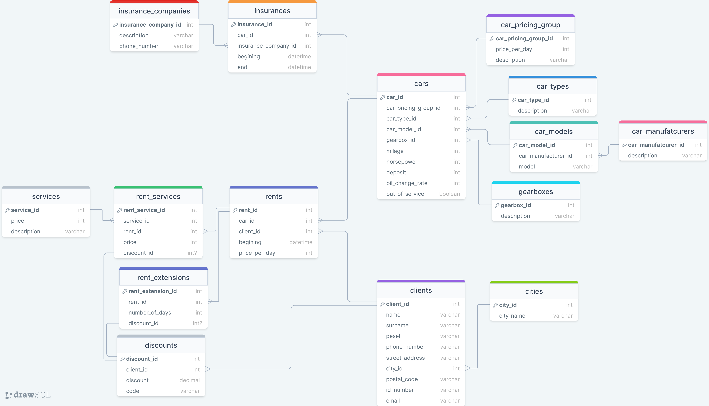

**Temat:** Wypożyczalnia samochodów

**Autorzy:** Piotr Kalisz, Tomasz Kostrzewa, Konrad Gromala, Jakub Kraj, Mateusz Oleksy

# 1. Zakres i krótki opis systemu

System wypożyczalni samochodów, o którym mowa, jest skomplikowanym i wielofunkcyjnym narzędziem, które służy do obsługi klientów chcących wynająć pojazdy, zarządzania samochodami, oferowania dodatkowych usług oraz zarządzania relacjami z firmami ubezpieczeniowymi.

Klienci, korzystając z systemu, mogą przeglądać dostępne pojazdy, wybierać różne typy i klasy samochodów zgodnie z własnymi potrzebami. System umożliwia także monitorowanie i zarządzanie historią wynajmów każdego klienta, co obejmuje daty rozpoczęcia i zakończenia wynajmu.
Klienci mają również możliwość skorzystania ze zniżek, które mogą być aplikowane do transakcji za pomocą specjalnych kodów rabatowych.

System dba także o bieżące zarządzanie pojazdami, monitorując ich stan techniczny, przebieg, częstotliwość wymiany oleju i inne parametry techniczne, co pomaga w utrzymaniu pojazdów w dobrym stanie oraz planowaniu przeglądów i napraw. Każdy samochód jest ubezpieczony, a system zarządza również polisami ubezpieczeniowymi, w tym terminami ich ważności oraz współpracą z firmami ubezpieczeniowymi.

Dodatkowo, system posiada funkcje zarządzania danymi klientów, w tym ich informacjami kontaktowymi, adresami oraz innymi danymi osobowymi, które są niezbędne do procesu wynajmu. Klienci mogą być zlokalizowani w różnych miastach, a system umożliwia zarządzanie tymi informacjami w sposób zorganizowany.

Podsumowując, system jest kompleksowym rozwiązaniem dla wypożyczalni samochodów, które ułatwia zarządzanie wynajmem, klientami, pojazdami oraz usługami dodatkowymi, a wszystko to w celu stworzenia wygodnego i efektywnego serwisu dla klientów.

# 2. Wymagania i funkcje systemu

- **Wynajem i Rezerwacja Pojazdów**:
    - Kategoryzacja pojazdów z uwzględnieniem szczegółowych opisów ich parametrów technicznych i wyposażenia.
    - Wynajem samochodów na określony okres.
    - Ustalanie i aktualizacja stawek wynajmu oraz cen za usługi dodatkowe.

- **Zarządzanie Klientami**:
    - Gromadzenie, aktualizacja i zarządzanie danymi osobowymi klientów.
    - Monitorowanie historii wynajmów dla każdego klienta.
    - Zarządzanie danymi dotyczącymi lokalizacji klientów.

- **Zarządzanie Flotą Pojazdów**:
    - Śledzenie dostępności pojazdów w czasie rzeczywistym, zapewniające efektywne zarządzanie flotą.
    - Monitorowanie stanu technicznego i serwisowania pojazdów.
    - Zarządzanie polisami ubezpieczeniowymi przypisanymi do pojazdów.

- **Zarządzanie Zniżkami**:
    - Tworzenie i zarządzanie ofertami promocyjnymi i zniżkami dla klientów.
    - Implementacja systemu kodów rabatowych przy transakcjach wynajmu.

- **Analiza i Raportowanie Danych**:
    - Rejestrowanie danych o terminach wynajmu i kompleksowa historia transakcji.
    - Analiza zebranych danych w celu optymalizacji procesów i oferty wypożyczalni.

# 3. Projekt bazy danych

## Schemat bazy danych

## Opis poszczególnych tabel

# 4. Implementacja

## Kod poleceń DDL

## Widoki

## Procedury/funkcje

## Triggery