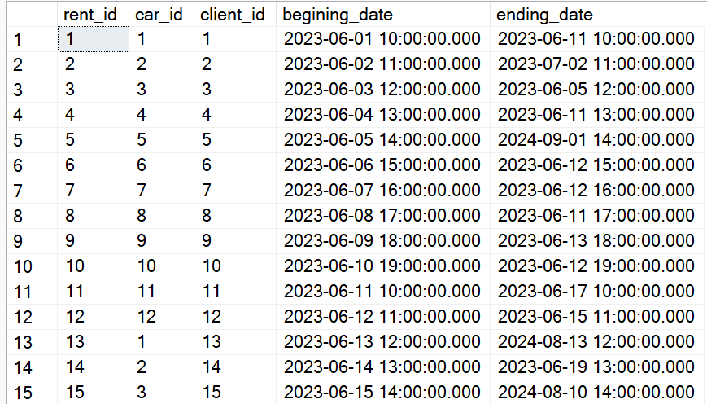
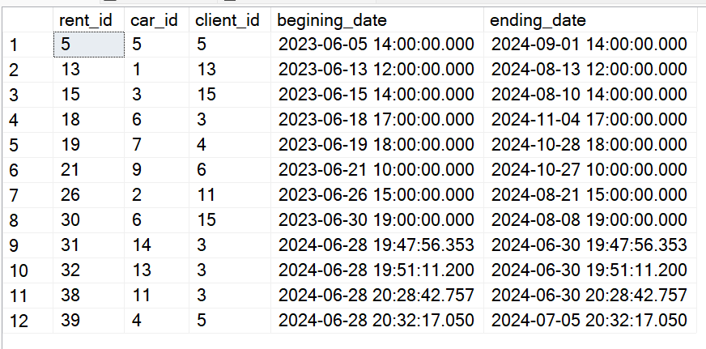
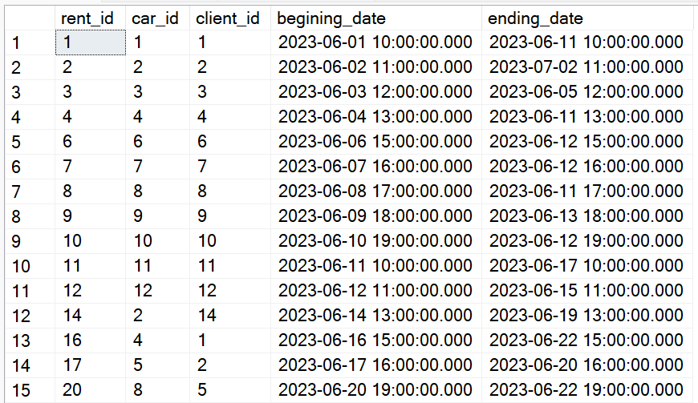
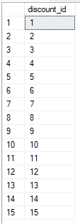
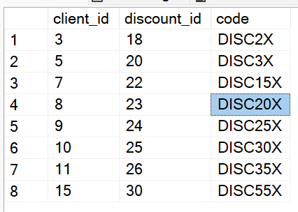

**Temat:** Wypożyczalnia samochodów

**Autorzy:** Piotr Kalisz, Tomasz Kostrzewa, Konrad Gromala, Jakub Kraj, Mateusz Oleksy

# 1. Zakres i krótki opis systemu

System wypożyczalni samochodów, o którym mowa, jest skomplikowanym i wielofunkcyjnym narzędziem, które służy do obsługi klientów chcących wynająć pojazdy, zarządzania samochodami, oferowania dodatkowych usług oraz zarządzania relacjami z firmami ubezpieczeniowymi.

Klienci, korzystając z systemu, mogą przeglądać dostępne pojazdy, wybierać różne typy i klasy samochodów zgodnie z własnymi potrzebami. System umożliwia także monitorowanie i zarządzanie historią wynajmów każdego klienta, co obejmuje daty rozpoczęcia i zakończenia wynajmu.
Klienci mają również możliwość skorzystania ze zniżek, które mogą być aplikowane do transakcji za pomocą specjalnych kodów rabatowych. Kody rabatowe mogą być użyte jedynie raz.

System dba także o bieżące zarządzanie pojazdami, monitorując ich stan techniczny, przebieg, częstotliwość wymiany oleju i inne parametry techniczne, co pomaga w utrzymaniu pojazdów w dobrym stanie oraz planowaniu przeglądów i napraw. Każdy samochód jest ubezpieczony, a system zarządza również polisami ubezpieczeniowymi, w tym terminami ich ważności oraz współpracą z firmami ubezpieczeniowymi.

Dodatkowo, system posiada funkcje zarządzania danymi klientów, w tym ich informacjami kontaktowymi, adresami oraz innymi danymi osobowymi, które są niezbędne do procesu wynajmu. Klienci mogą być zlokalizowani w różnych miastach, a system umożliwia zarządzanie tymi informacjami w sposób zorganizowany.

Podsumowując, system jest kompleksowym rozwiązaniem dla wypożyczalni samochodów, które ułatwia zarządzanie wynajmem, klientami, pojazdami oraz usługami dodatkowymi, a wszystko to w celu stworzenia wygodnego i efektywnego serwisu dla klientów.

# 2. Wymagania i funkcje systemu

- **Wynajem i Rezerwacja Pojazdów**:
    - Kategoryzacja pojazdów z uwzględnieniem szczegółowych opisów ich parametrów technicznych i wyposażenia.
    - Wynajem samochodów na określony okres.
    - Ustalanie i aktualizacja stawek wynajmu oraz cen za usługi dodatkowe.

- **Zarządzanie Klientami**:
    - Gromadzenie, aktualizacja i zarządzanie danymi osobowymi klientów.
    - Monitorowanie historii wynajmów dla każdego klienta.
    - Zarządzanie danymi dotyczącymi lokalizacji klientów.

- **Zarządzanie Flotą Pojazdów**:
    - Śledzenie dostępności pojazdów w czasie rzeczywistym, zapewniające efektywne zarządzanie flotą.
    - Monitorowanie stanu technicznego i serwisowania pojazdów.
    - Zarządzanie polisami ubezpieczeniowymi przypisanymi do pojazdów.

- **Zarządzanie Zniżkami**:
    - Tworzenie i zarządzanie ofertami promocyjnymi i zniżkami dla klientów.
    - Implementacja systemu kodów rabatowych przy transakcjach wynajmu.

- **Analiza i Raportowanie Danych**:
    - Rejestrowanie danych o terminach wynajmu i kompleksowa historia transakcji.
    - Analiza zebranych danych w celu optymalizacji procesów i oferty wypożyczalni.

# 3. Projekt bazy danych

## Schemat bazy danych


## Opis poszczególnych tabel

- **rent_extensions:** Tabela przechowuje informacje o przedłużeniach wynajmu. Każde przedłużenie jest powiązane z określonym wynajmem i może obejmować zniżkę.
    - `rent_extension_id`: Unikalny identyfikator przedłużenia wynajmu.
    - `rent_id`: Identyfikator wynajmu, do którego odnosi się przedłużenie.
    - `number_of_days`: Liczba dni przedłużenia wynajmu.
    - `discount_id`: Identyfikator zniżki zastosowanej do przedłużenia (opcjonalnie).

- **rents:** Tabela zawiera informacje o wynajmach samochodów. Każdy wpis odnosi się do konkretnego samochodu i klienta.
    - `rent_id`: Unikalny identyfikator wynajmu.
    - `car_id`: Identyfikator wynajmowanego samochodu.
    - `client_id`: Identyfikator klienta wynajmującego samochód.
    - `begining`: Data i godzina rozpoczęcia wynajmu.
    - `price_per_day`: Cena wynajmu za dzień.

- **car_pricing_group:** Tabela przechowuje informacje o grupach cenowych samochodów.
    - `car_pricing_group_id`: Unikalny identyfikator grupy cenowej.
    - `price_per_day`: Cena wynajmu za dzień w tej grupie cenowej.
    - `description`: Opis grupy cenowej.

- **discounts:** Tabela zawiera informacje o zniżkach przyznawanych klientom.
    - `discount_id`: Unikalny identyfikator zniżki.
    - `client_id`: Identyfikator klienta, który otrzymał zniżkę.
    - `discount`: Wartość zniżki procentowo.
    - `code`: Kod zniżki.

- **car_models:** Tabela przechowuje informacje o modelach samochodów.
    - `car_model_id`: Unikalny identyfikator modelu samochodu.
    - `car_manufacturer_id`: Identyfikator producenta samochodu.
    - `model`: Nazwa modelu samochodu.

- **car_types:** Tabela zawiera informacje o typach samochodów.
    - `car_type_id`: Unikalny identyfikator typu samochodu.
    - `description`: Opis typu samochodu.

- **insurances:** Tabela przechowuje informacje o ubezpieczeniach samochodów.
    - `insurance_id`: Unikalny identyfikator ubezpieczenia.
    - `car_id`: Identyfikator ubezpieczonego samochodu.
    - `insurance_company_id`: Identyfikator firmy ubezpieczeniowej.
    - `begining`: Data rozpoczęcia ubezpieczenia.
    - `end`: Data zakończenia ubezpieczenia.

- **cities:** Tabela zawiera informacje o miastach.
    - `city_id`: Unikalny identyfikator miasta.
    - `city_name`: Nazwa miasta.

- **insurance_companies:** Tabela przechowuje informacje o firmach ubezpieczeniowych.
    - `insurance_company_id`: Unikalny identyfikator firmy ubezpieczeniowej.
    - `phone_number`: Numer telefonu firmy ubezpieczeniowej.
    - `description`: Opis firmy ubezpieczeniowej.

- **car_manufacurers:** Tabela zawiera informacje o producentach samochodów.
    - `car_manufacurer_id`: Unikalny identyfikator producenta samochodu.
    - `description`: Opis producenta samochodu.

- **services:** Tabela przechowuje informacje o usługach dodatkowych.
    - `service_id`: Unikalny identyfikator usługi.
    - `price`: Cena usługi.
    - `description`: Opis usługi.

- **cars:** Tabela zawiera informacje o samochodach dostępnych do wynajmu.
    - `car_id`: Unikalny identyfikator samochodu.
    - `car_pricing_group_id`: Identyfikator grupy cenowej samochodu.
    - `car_type_id`: Identyfikator typu samochodu.
    - `car_model_id`: Identyfikator modelu samochodu.
    - `gearbox_id`: Identyfikator skrzyni biegów.
    - `milage`: Przebieg samochodu.
    - `horsepower`: Moc silnika w koniach mechanicznych.
    - `deposit`: Kaucja za wynajem samochodu.
    - `oil_change_rate`: Częstotliwość wymiany oleju w kilometrach.
    - `out_of_service`: Status dostępności samochodu (0 - dostępny, 1 - niedostępny).

- **gearboxes:** Tabela przechowuje informacje o skrzyniach biegów.
    - `gearbox_id`: Unikalny identyfikator skrzyni biegów.
    - `description`: Opis skrzyni biegów.

- **rent_services:** Tabela zawiera informacje o usługach dodatkowych powiązanych z wynajmem.
    - `rent_service_id`: Unikalny identyfikator usługi wynajmu.
    - `service_id`: Identyfikator usługi.
    - `rent_id`: Identyfikator wynajmu.
    - `price`: Cena usługi wynajmu.
    - `discount_id`: Identyfikator zniżki na usługę wynajmu (opcjonalnie).

- **clients:** Tabela przechowuje informacje o klientach.
    - `client_id`: Unikalny identyfikator klienta.
    - `name`: Imię klienta.
    - `surname`: Nazwisko klienta.
    - `pesel`: Numer PESEL klienta.
    - `phone_number`: Numer telefonu klienta.
    - `street_address`: Adres zamieszkania klienta.
    - `city_id`: Identyfikator miasta, w którym mieszka klient.
    - `postal_code`: Kod pocztowy klienta.
    - `id_number`: Numer dowodu osobistego klienta.
    - `email`: Adres e-mail klienta.

# 4. Implementacja

## Kod poleceń DDL

```sql
CREATE TABLE car_pricing_group(
    car_pricing_group_id INT NOT NULL IDENTITY(1, 1),
    price_per_day INT NOT NULL CHECK (price_per_day > 0),
    description VARCHAR(255) NOT NULL,
    PRIMARY KEY (car_pricing_group_id),
    CONSTRAINT car_pricing_group_unique_description UNIQUE (description)
);
```

```sql
CREATE TABLE car_types(
    car_type_id INT NOT NULL IDENTITY(1, 1),
    description VARCHAR(255) NOT NULL,
    PRIMARY KEY (car_type_id),
    CONSTRAINT car_types_unique_description UNIQUE (description)
);
```

```sql
CREATE TABLE car_manufacturers(
    car_manufacturer_id INT NOT NULL IDENTITY(1, 1),
    description VARCHAR(255) NOT NULL,
    PRIMARY KEY (car_manufacturer_id),
    CONSTRAINT car_manufacturers_unique_description UNIQUE (description)
);
```

```sql
CREATE TABLE car_models(
    car_model_id INT NOT NULL IDENTITY(1, 1),
    car_manufacturer_id INT NOT NULL,
    model VARCHAR(32) NOT NULL,
    PRIMARY KEY (car_model_id),
    CONSTRAINT car_models_unique_model UNIQUE (car_manufacturer_id, model),
    CONSTRAINT car_models_car_manufacturer_id FOREIGN KEY (car_manufacturer_id) REFERENCES car_manufacturers(car_manufacturer_id)
);
```

```sql
CREATE TABLE gearboxes(
    gearbox_id INT NOT NULL IDENTITY(1, 1),
    description VARCHAR(255) NOT NULL,
    PRIMARY KEY (gearbox_id),
    CONSTRAINT gearboxes_unique_description UNIQUE (description)
);
```

```sql
CREATE TABLE cars(
    car_id INT NOT NULL IDENTITY(1, 1),
    car_pricing_group_id INT NOT NULL,
    car_type_id INT NOT NULL,
    car_model_id INT NOT NULL,
    gearbox_id INT NOT NULL,
    milage INT NOT NULL CHECK (milage >= 0),
    horsepower INT NOT NULL CHECK (horsepower > 0),
    deposit INT NOT NULL CHECK (deposit >= 0),
    oil_change_rate INT NOT NULL CHECK (oil_change_rate > 0),
    out_of_service BIT NOT NULL,
    PRIMARY KEY (car_id),
    CONSTRAINT cars_car_pricing_group_id FOREIGN KEY (car_pricing_group_id) REFERENCES car_pricing_group(car_pricing_group_id),
    CONSTRAINT cars_car_type_id FOREIGN KEY (car_type_id) REFERENCES car_types(car_type_id),
    CONSTRAINT cars_car_model_id FOREIGN KEY (car_model_id) REFERENCES car_models(car_model_id),
    CONSTRAINT cars_gearbox_id FOREIGN KEY (gearbox_id) REFERENCES gearboxes(gearbox_id)
);
```

```sql
CREATE TABLE cities(
    city_id INT NOT NULL IDENTITY(1, 1),
    city_name VARCHAR(32) NOT NULL,
    PRIMARY KEY (city_id),
    CONSTRAINT cities_unique_city_name UNIQUE (city_name)
);
```

```sql
CREATE TABLE clients(
    client_id INT NOT NULL IDENTITY(1, 1),
    name VARCHAR(32) NOT NULL,
    surname VARCHAR(32) NOT NULL,
    pesel VARCHAR(11) NOT NULL,
    phone_number VARCHAR(16) NOT NULL,
    street_address VARCHAR(32) NOT NULL,
    city_id INT NOT NULL,
    postal_code VARCHAR(6) NOT NULL,
    id_number VARCHAR(16) NOT NULL,
    email VARCHAR(32) NOT NULL,
    PRIMARY KEY (client_id),
    CONSTRAINT clients_unique_email UNIQUE (name, surname, email),
    CONSTRAINT clients_city_id FOREIGN KEY (city_id) REFERENCES cities(city_id)
);
```

```sql
CREATE TABLE rents(
    rent_id INT NOT NULL IDENTITY(1, 1),
    car_id INT NOT NULL,
    client_id INT NOT NULL,
    begining DATETIME NOT NULL,
    price_per_day INT NOT NULL CHECK (price_per_day > 0),
    PRIMARY KEY (rent_id),
    CONSTRAINT rents_car_id FOREIGN KEY (car_id) REFERENCES cars(car_id),
    CONSTRAINT rents_client_id FOREIGN KEY (client_id) REFERENCES clients(client_id)
);
```

```sql
CREATE TABLE discounts(
    discount_id INT NOT NULL IDENTITY(1, 1),
    client_id INT NOT NULL,
    discount DECIMAL(3, 2) NOT NULL CHECK (discount > 0 AND discount < 1),
    code VARCHAR(8) NOT NULL,
    PRIMARY KEY (discount_id),
    CONSTRAINT discounts_unique_code UNIQUE (client_id, code),
    CONSTRAINT discounts_client_id FOREIGN KEY (client_id) REFERENCES clients(client_id)
);
```

```sql
CREATE TABLE rent_extensions(
    rent_extension_id INT NOT NULL IDENTITY(1, 1),
    rent_id INT NOT NULL,
    number_of_days INT NOT NULL CHECK (number_of_days > 0),
    discount_id INT NULL,
    PRIMARY KEY (rent_extension_id),
    CONSTRAINT rent_extensions_rent_id FOREIGN KEY (rent_id) REFERENCES rents(rent_id),
    CONSTRAINT rent_extensions_discount_id FOREIGN KEY (discount_id) REFERENCES discounts(discount_id)
);
```

```sql
CREATE TABLE insurance_companies(
    insurance_company_id INT NOT NULL IDENTITY(1, 1),
    phone_number VARCHAR(16) NOT NULL,
    description VARCHAR(255) NOT NULL,
    PRIMARY KEY (insurance_company_id),
    CONSTRAINT insurance_companies_unique_description UNIQUE (description)
);
```

```sql
CREATE TABLE insurances(
    insurance_id INT NOT NULL IDENTITY(1, 1),
    car_id INT NOT NULL,
    insurance_company_id INT NOT NULL,
    begining_date DATETIME NOT NULL,
    end_date DATETIME NOT NULL,
    PRIMARY KEY (insurance_id),
    CONSTRAINT insurances_car_id FOREIGN KEY (car_id) REFERENCES cars(car_id),
    CONSTRAINT insurances_insurance_company_id FOREIGN KEY (insurance_company_id) REFERENCES insurance_companies(insurance_company_id),
    CONSTRAINT date_check CHECK (begining_date < end_date)
);
```

```sql
CREATE TABLE services(
    service_id INT NOT NULL IDENTITY(1, 1),
    price INT NOT NULL CHECK (price > 0),
    description VARCHAR(255) NOT NULL,
    PRIMARY KEY (service_id),
    CONSTRAINT services_unique_description UNIQUE (description)
);
```

```sql
CREATE TABLE rent_services(
    rent_service_id INT NOT NULL IDENTITY(1, 1),
    service_id INT NOT NULL,
    rent_id INT NOT NULL,
    price INT NOT NULL CHECK (price > 0),
    discount_id INT NULL,
    PRIMARY KEY (rent_service_id),
    CONSTRAINT rent_services_service_id FOREIGN KEY (service_id) REFERENCES services(service_id),
    CONSTRAINT rent_services_rent_id FOREIGN KEY (rent_id) REFERENCES rents(rent_id),
    CONSTRAINT rent_services_discount_id FOREIGN KEY (discount_id) REFERENCES discounts(discount_id)
);
```

## Widoki

### Widok rents_timespan:
- **Implementacja:**
    ```sql
    CREATE VIEW rents_timespan AS
    SELECT
        rents.rent_id,
        rents.begining as begining_date,
        DATEADD(DAY, SUM(rent_extensions.number_of_days), rents.begining) as ending_date
    FROM rents
    JOIN rent_extensions
        ON rent_extensions.rent_id = rents.rent_id
    GROUP BY rents.rent_id, rents.begining;
    ```
- **Effekt użycia:**
    <br>

### Widok rents_active:
- **Implementacja:**
    ```sql
    CREATE VIEW rents_active AS
    SELECT
        rent_id,
        begining_date,
        ending_date
    FROM rents_timespan
    WHERE begining_date < GETDATE() AND ending_date > GETDATE();
    ```
- **Effekt użycia:**
    <br>

### Widok rents_expired:
- **Implementacja:**
    ```sql
    CREATE VIEW rents_expired AS
    SELECT
        rent_id,
        begining_date,
        ending_date
    FROM rents_timespan
    WHERE ending_date < GETDATE();
    ```
- **Effekt użycia:**
    <br>

### Widok discounts_used:
- **Implementacja:**
    ```sql
    CREATE VIEW discounts_used AS
    SELECT discount_id FROM rent_services
    WHERE discount_id IS NOT NULL
    UNION
    SELECT discount_id FROM rent_extensions
    WHERE discount_id IS NOT NULL;
    ```
- **Effekt użycia:**
    <br>

### Widok discounts_available:
- **Implementacja:**
    ```sql
    CREATE VIEW discounts_available AS
    SELECT client_id, discount_id, code
    FROM discounts
    WHERE (SELECT COUNT(*) FROM discounts_used WHERE discount_id = discounts.discount_id) = 0;
    ```
- **Effekt użycia:**
    <br>

## Procedury/funkcje

```sql
CREATE PROCEDURE AddRentExtension
    @rent_id INT,
    @number_of_days INT,
    @discount_code VARCHAR(8) = NULL
AS
BEGIN
    DECLARE @discount_id INT = NULL;

    IF @rent_id NOT IN (SELECT rent_id FROM rents_active)
    BEGIN
        THROW 50001, 'The rent has already expired!', 1;
    END

    IF @discount_code IS NOT NULL
    BEGIN
        IF @discount_code NOT IN (SELECT code FROM discounts_available)
        BEGIN
            THROW 50000, 'Discount is not available!', 1;
        END
        SET @discount_id = (SELECT discount_id FROM discounts WHERE code = @discount_code);
    END

    INSERT INTO rent_extensions(rent_id, number_of_days, discount_id)
    VALUES (
        @rent_id,
        @number_of_days,
        @discount_id
    );
END;
```

```sql
CREATE PROCEDURE AddNewCar
    @CarPricingGroupId INT,
    @CarTypeDescription VARCHAR(255),
    @CarManufacturerDescription VARCHAR(255),
    @CarModelDescription VARCHAR(32),
    @GearboxId INT,
    @Milage INT,
    @Horsepower INT,
    @Deposit INT,
    @OilChangeRate INT
AS
BEGIN
    DECLARE @CarTypeId INT;
    DECLARE @CarManufacturerId INT;
    DECLARE @CarModelId INT;

    IF @CarTypeDescription IN (SELECT description FROM car_types)
    BEGIN
        SELECT @CarTypeId = car_type_id FROM car_types WHERE description = @CarTypeDescription;
    END
    ELSE
    BEGIN
        INSERT INTO car_types (description) VALUES (@CarTypeDescription);
        SELECT @CarTypeId = SCOPE_IDENTITY();
    END

    IF @CarManufacturerDescription IN (SELECT description FROM car_manufacturers)
    BEGIN
        SELECT @CarManufacturerId = car_manufacturer_id FROM car_manufacturers WHERE description = @CarManufacturerDescription;
    END
    ELSE
    BEGIN
        INSERT INTO car_manufacturers (description) VALUES (@CarManufacturerDescription);
        SELECT @CarManufacturerId = SCOPE_IDENTITY();
    END

    IF @CarModelDescription IN (SELECT model FROM car_models)
    BEGIN
        SELECT @CarModelId = car_model_id FROM car_models WHERE car_manufacturer_id = @CarManufacturerId AND model = @CarModelDescription;
    END
    ELSE
    BEGIN
        INSERT INTO car_models (car_manufacturer_id, model) VALUES (@CarManufacturerId, @CarModelDescription);
        SELECT @CarModelId = SCOPE_IDENTITY();
    END

    INSERT INTO cars (
        car_pricing_group_id, 
        car_type_id, 
        car_model_id, 
        gearbox_id, 
        milage, 
        horsepower, 
        deposit, 
        oil_change_rate, 
        out_of_service
    ) VALUES (
        @CarPricingGroupId, 
        @CarTypeId, 
        @CarModelId, 
        @GearboxId, 
        @Milage, 
        @Horsepower, 
        @Deposit, 
        @OilChangeRate, 
        0
    );
END;
```

```sql
CREATE PROCEDURE AddRentServicePurchase
    @rent_id INT,
    @service_id INT,
    @discount_code VARCHAR(8) = NULL
AS
BEGIN
    DECLARE @discount_id INT = NULL;
    DECLARE @discount_value DECIMAL(3, 2) = 0.00;
    DECLARE @client_id INT;
    DECLARE @original_price INT;

    IF @rent_id NOT IN (SELECT rent_id FROM rents_active)
    BEGIN
        THROW 50001, 'The rent has already expired!', 1;
    END

    IF @discount_code IS NOT NULL
    BEGIN
        IF @discount_code NOT IN (SELECT code FROM discounts_available)
        BEGIN
            THROW 50000, 'Discount is not available!', 1;
        END
        SET @discount_id = (SELECT discount_id FROM discounts WHERE code = @discount_code);
        SET @discount_value = (SELECT discount FROM discounts WHERE code = @discount_code);
    END

    SELECT @client_id = client_id
    FROM rents
    WHERE rent_id = @rent_id;

    SELECT @original_price = price
    FROM services
    WHERE service_id = @service_id;

    INSERT INTO rent_services (rent_id, service_id, price, discount_id)
    VALUES (
        @rent_id,
        @service_id,
        @original_price * (1 - @discount_value),
        @discount_id
    );
END;
```

## Triggery